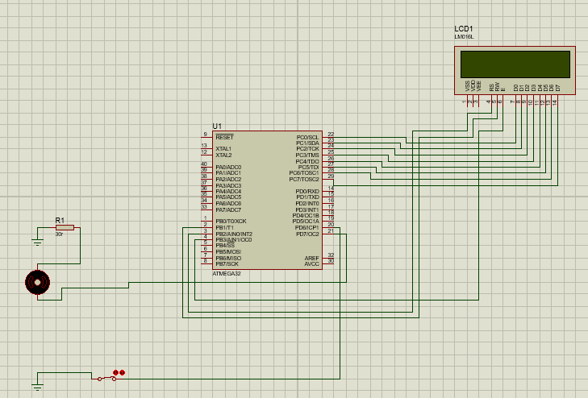

# ProjetoFinal_Display_LM016L
> Neste projeto é controlado um motor DC e através de um display é informado se o motor está ligado ou desligado.

O projeto consiste na criação de um circuito eletrônico gerenciado por um microcontrolador AVR ATMEGA32,
onde ao acionar uma chave, o display LM016L indicará se o motor está em funcionamento ou não. Toda a programação do hardware foi feita em assembly.

## Instalação

ATmega32

## Uso
Para utilizar o software e o circuito, deve-se instalar os programas listados abaixo:

## Programas para desenvolvimento

* Proteus 8 - elaboração do esquema eletrônico
* Atmel Studio 7 - elaboração do código assembly e compilador avr32

* https://www.labcenter.com/downloads/ Proteus
* https://www.microchip.com/mplab/avr-support/atmel-studio-7 - Atmel Studio 7

## Componentes Utilizados

* 2 x Capactior de 32 uf.
   
* 1 x Crystal .
   
* MicroControlador ATmega32.
    
* 1 x Resistor 30r.
    
* 1 x Motor DC 3v.

* 1 x Switch.

* 1 x Display LM016L.
 

    

## Participantes

* Rodrigo Gradela – rodrigo_gradela@hotmail.com
* Gustavo Ferrara - guataulo@gmail.com
* Vinícius do Carmo - vinicius.carmo18@outlook.com
* Marcelo Patricio - marcelinho.patricio2@gmail.com

* Trabalho Acadêmico
https://github.com/rodrigogradela/disp_LM016L - Rodrigo Gradela

## Contribuição

1. MicroChip (<http://ww1.microchip.com/downloads/en/devicedoc/doc2503.pdf>)
2. Manual Proteus (<https://www.docsity.com/pt/manual-do-proteus-em-portugues/4774790/>)
3. Datasheet LM016L (<https://www.alldatasheet.com/datasheet-pdf/pdf/146552/HITACHI/LM016L.html>)
